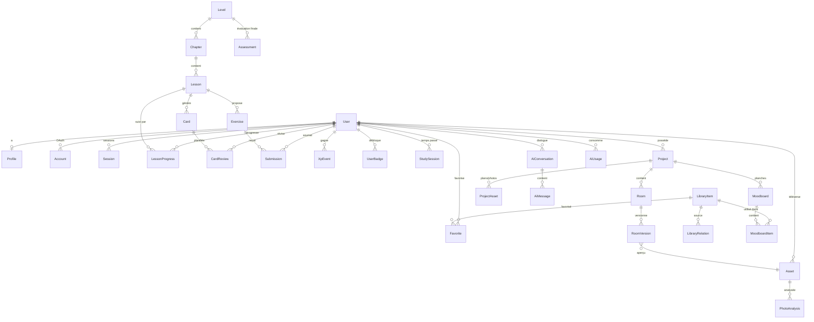

# 04 — Modèle de données

> **Statut** : v1.0 — en attente de validation
> Schéma Prisma cible pour la V1. Il sera livré par morceaux au fil des modules
> (M1 apporte l'auth + le curriculum, M3 le SRS, M4 l'atelier, etc.) — mais il
> est conçu en entier maintenant pour éviter les migrations douloureuses.

---

## 1. Trois décisions de modélisation à comprendre d'abord

### 1.1 Contenu pédagogique : Git, pas la base

Les leçons vivent en **MDX dans le dépôt** ; la base ne stocke que des
métadonnées et un `contentHash`.

*Pourquoi* : le contenu est du texte qui se relit en pull request, se versionne,
se compare et se restaure. Le mettre en base imposerait de construire un CMS —
c'est-à-dire un deuxième produit. Voir [ADR-0010](adr/0010-contenu-mdx-versionne.md).

*Conséquence* : la progression pointe vers une `Lesson` en base, qui référence
un fichier par `slug`. Un script de synchronisation vérifie à chaque build que
tous les slugs référencés existent (échec du build sinon).

### 1.2 Scène du simulateur : JSONB, pas 40 tables

Une version de projet stocke sa scène complète dans un champ `jsonb`
(`sceneData`), validé par un schéma Zod versionné.

*Pourquoi* : on ne fait jamais de requête SQL du type « tous les canapés à
moins de 80 cm d'un mur ». On charge **toujours la scène entière** pour la
dessiner. Un modèle relationnel fin (Wall, Opening, FurnitureInstance,
Transform…) coûterait des dizaines de jointures à chaque ouverture, imposerait
une migration à chaque nouvelle propriété géométrique, et rendrait le
versionnement (SIM-09) inutilement complexe alors qu'un JSONB se duplique en
une ligne.

*Ce qu'on garde en relationnel* : tout ce qui doit être filtré, agrégé ou
sécurisé — projets, pièces, versions, ressources, favoris.

*Le garde-fou* : `sceneVersion` (entier) permet des migrations de forme, et le
schéma Zod est la source de vérité unique côté client comme serveur.

### 1.3 Bibliothèque : une table, un discriminant, des attributs typés

Un `LibraryItem` unique avec `category` (enum) et un `attributes` JSONB dont le
schéma Zod dépend de la catégorie.

*Pourquoi pas une table par catégorie* : 15 tables presque identiques
(description, avantages, inconvénients, budget, entretien…), 15 requêtes à
unir pour une recherche transverse, et une migration à chaque nouvelle
catégorie. Les champs communs — qui portent l'essentiel de la valeur
pédagogique — sont en colonnes ; seul le spécifique (dureté d'une pierre,
indice de rendu de couleur d'un luminaire) va en JSONB.

*Le compromis assumé* : on ne peut pas indexer nativement les attributs
spécifiques. Acceptable : les filtres de la V1 (budget, pièce, style,
entretien) portent tous sur des colonnes réelles.

---

## 2. Diagramme d'ensemble



---

## 3. Schéma Prisma

### 3.1 Identité et profil

```prisma
// Auth.js v5 — modèles imposés par l'adaptateur Prisma
model User {
  id            String    @id @default(cuid())
  email         String    @unique
  emailVerified DateTime?
  name          String?
  image         String?
  passwordHash  String?   // null si compte OAuth uniquement (Argon2id sinon)
  role          Role      @default(LEARNER)
  createdAt     DateTime  @default(now())
  updatedAt     DateTime  @updatedAt
  deletedAt     DateTime? // suppression logique : purge différée (RGPD, AUTH-04)

  profile         Profile?
  accounts        Account[]
  sessions        Session[]
  lessonProgress  LessonProgress[]
  levelProgress   LevelProgress[]
  cardReviews     CardReview[]
  submissions     Submission[]
  xpEvents        XpEvent[]
  badges          UserBadge[]
  studySessions   StudySession[]
  projects        Project[]
  assets          Asset[]
  conversations   AiConversation[]
  aiUsage         AiUsage[]
  favorites       Favorite[]

  @@index([deletedAt])
}

enum Role { LEARNER ADMIN }

model Profile {
  userId          String   @id
  user            User     @relation(fields: [userId], references: [id], onDelete: Cascade)

  // Onboarding (AUTH-02) — pilote les recommandations
  goal            Goal     @default(WHOLE_HOME)
  housingType     Housing? // maison, appartement, studio…
  weeklyMinutes   Int      @default(150)  // objectif hebdo (PROG-04)
  startingLevel   Int      @default(1)    // issu du diagnostic express

  theme           Theme    @default(SYSTEM)
  locale          String   @default("fr")
  reducedMotion   Boolean  @default(false)
  soundEnabled    Boolean  @default(false)

  // Compteurs dénormalisés — lus à chaque affichage, recalculables à la demande
  totalXp         Int      @default(0)
  currentStreak   Int      @default(0)
  longestStreak   Int      @default(0)
  lastActiveDate  DateTime?
  streakFreezes   Int      @default(1)   // PROG-03

  aiMonthlyQuota  Int      @default(200) // appels/mois (AI-10)
  onboardedAt     DateTime?
}

enum Goal    { WHOLE_HOME SINGLE_ROOM CAREER CURIOSITY }
enum Housing { HOUSE APARTMENT STUDIO OTHER }
enum Theme   { LIGHT DARK SYSTEM }
```

> **Note sur les compteurs dénormalisés** (`totalXp`, `currentStreak`) : ils
> sont redondants avec `XpEvent`. C'est délibéré — le tableau de bord les
> affiche à chaque chargement et une agrégation sur l'historique complet
> deviendrait lente. Ils sont recalculables par une tâche de réconciliation,
> qui sert aussi de test d'intégrité.

### 3.2 Curriculum

```prisma
model Level {
  id          String   @id @default(cuid())
  number      Int      @unique          // 1..15
  slug        String   @unique          // "decouverte"
  title       String
  summary     String
  phase       Int                        // 1..4 (regroupement de la carte)
  estimatedMinutes Int
  requiresLevel Int?                     // règle de déverrouillage (LEARN-09)
  passingScore  Int     @default(70)
  published     Boolean @default(false)

  chapters    Chapter[]
  assessments Assessment[]
  progress    LevelProgress[]

  @@index([phase, number])
}

model Chapter {
  id       String @id @default(cuid())
  levelId  String
  level    Level  @relation(fields: [levelId], references: [id], onDelete: Cascade)
  number   Int
  slug     String
  title    String
  lessons  Lesson[]

  @@unique([levelId, number])
}

model Lesson {
  id          String  @id @default(cuid())
  chapterId   String
  chapter     Chapter @relation(fields: [chapterId], references: [id], onDelete: Cascade)
  number      Int
  slug        String  @unique            // ← pointe vers content/niveaux/…/xx.mdx
  title       String
  summary     String
  minutes     Int
  xpReward    Int     @default(20)
  contentHash String                     // détecte un contenu modifié en base
  videoUrl    String?                    // LEARN-03 : structure prête, vide en V1
  published   Boolean @default(false)

  exercises Exercise[]
  cards     Card[]
  progress  LessonProgress[]

  @@unique([chapterId, number])
}
```

### 3.3 Exercices, quiz, soumissions

```prisma
model Exercise {
  id        String       @id @default(cuid())
  lessonId  String?
  lesson    Lesson?      @relation(fields: [lessonId], references: [id], onDelete: Cascade)
  assessmentId String?
  assessment   Assessment? @relation(fields: [assessmentId], references: [id], onDelete: Cascade)

  type      ExerciseType
  prompt    String
  /// Forme dépendant du type, validée par un schéma Zod discriminé :
  /// QUIZ_MCQ → { choices, correctIds, explanations }
  /// HOTSPOT  → { imageId, zones: [{x,y,r,label,correct}] }
  /// LAYOUT   → { roomTemplate, catalog, constraints }
  /// PALETTE  → { brief, acceptableRanges }
  /// OPEN     → { rubric: [{critere, poids, description}] }  ← corrigé par l'IA
  payload   Json
  maxScore  Int          @default(100)
  xpReward  Int          @default(10)
  order     Int          @default(0)

  submissions Submission[]
}

enum ExerciseType {
  QUIZ_MCQ QUIZ_TRUE_FALSE QUIZ_MATCH QUIZ_ORDER HOTSPOT
  LAYOUT PALETTE MATERIAL_CHOICE OPEN_CASE CHALLENGE
}

model Submission {
  id          String   @id @default(cuid())
  userId      String
  user        User     @relation(fields: [userId], references: [id], onDelete: Cascade)
  exerciseId  String
  exercise    Exercise @relation(fields: [exerciseId], references: [id], onDelete: Cascade)

  answer      Json                     // réponse brute de l'utilisateur
  score       Int?                     // null tant que non corrigé
  feedback    Json?                    // { points_forts[], axes[], detail_bareme[] }
  gradedBy    GradedBy @default(AUTO)
  attempt     Int      @default(1)
  timeSpentMs Int?
  createdAt   DateTime @default(now())

  @@index([userId, exerciseId])
}

enum GradedBy { AUTO AI }

model Assessment {
  id          String @id @default(cuid())
  levelId     String
  level       Level  @relation(fields: [levelId], references: [id], onDelete: Cascade)
  title       String
  passingScore Int   @default(70)
  exercises   Exercise[]
}
```

### 3.4 Progression

```prisma
model LessonProgress {
  id          String   @id @default(cuid())
  userId      String
  user        User     @relation(fields: [userId], references: [id], onDelete: Cascade)
  lessonId    String
  lesson      Lesson   @relation(fields: [lessonId], references: [id], onDelete: Cascade)

  status      ProgressStatus @default(NOT_STARTED)
  blockIndex  Int      @default(0)   // reprise exacte : « où j'en étais »
  timeSpentMs Int      @default(0)
  completedAt DateTime?
  updatedAt   DateTime @updatedAt

  @@unique([userId, lessonId])
  @@index([userId, status])
}

enum ProgressStatus { NOT_STARTED IN_PROGRESS COMPLETED }

model LevelProgress {
  id           String   @id @default(cuid())
  userId       String
  user         User     @relation(fields: [userId], references: [id], onDelete: Cascade)
  levelId      String
  level        Level    @relation(fields: [levelId], references: [id], onDelete: Cascade)
  unlockedAt   DateTime?
  completedAt  DateTime?
  bestScore    Int?

  @@unique([userId, levelId])
}

model XpEvent {
  id        String   @id @default(cuid())
  userId    String
  user      User     @relation(fields: [userId], references: [id], onDelete: Cascade)
  amount    Int
  reason    XpReason
  refId     String?                 // leçon, exercice, projet concerné
  createdAt DateTime @default(now())

  @@index([userId, createdAt])
}

enum XpReason { LESSON QUIZ EXERCISE REVIEW ASSESSMENT PROJECT STREAK CHALLENGE }

model Badge {
  id          String  @id @default(cuid())
  slug        String  @unique
  title       String
  description String
  icon        String
  /// Règle déclarative évaluée par packages/domain, ex. :
  /// { type: "streak", days: 7 } | { type: "level_complete", level: 3 }
  /// { type: "count", metric: "photo_analysis", gte: 10 }
  criteria    Json
  users       UserBadge[]
}

model UserBadge {
  userId    String
  user      User     @relation(fields: [userId], references: [id], onDelete: Cascade)
  badgeId   String
  badge     Badge    @relation(fields: [badgeId], references: [id], onDelete: Cascade)
  earnedAt  DateTime @default(now())

  @@id([userId, badgeId])
}

/// Temps réel passé, alimenté par heartbeat toutes les 30 s (PROG-05).
/// On ne compte pas un onglet ouvert et oublié.
model StudySession {
  id         String   @id @default(cuid())
  userId     String
  user       User     @relation(fields: [userId], references: [id], onDelete: Cascade)
  startedAt  DateTime
  endedAt    DateTime?
  activeMs   Int      @default(0)
  context    String?  // "lesson:3.4" | "studio" | "review"

  @@index([userId, startedAt])
}
```

### 3.5 Répétition espacée (FSRS)

```prisma
/// Une carte est générée depuis une leçon (frontmatter MDX) ou créée
/// automatiquement après une erreur récurrente sur un thème.
model Card {
  id        String  @id @default(cuid())
  lessonId  String?
  lesson    Lesson? @relation(fields: [lessonId], references: [id], onDelete: SetNull)
  front     String
  back      String
  hint      String?
  imageId   String?
  topic     String              // "couleur", "eclairage"… → analyse des points faibles
  reviews   CardReview[]

  @@index([topic])
}

/// État FSRS-6 par (utilisateur, carte). Voir ADR-0007.
model CardReview {
  id            String   @id @default(cuid())
  userId        String
  user          User     @relation(fields: [userId], references: [id], onDelete: Cascade)
  cardId        String
  card          Card     @relation(fields: [cardId], references: [id], onDelete: Cascade)

  stability     Float                  // paramètre S de FSRS
  difficulty    Float                  // paramètre D
  dueAt         DateTime
  lastReviewAt  DateTime?
  reps          Int      @default(0)
  lapses        Int      @default(0)
  state         CardState @default(NEW)
  lastRating    Int?                   // 1 Again · 2 Hard · 3 Good · 4 Easy

  @@unique([userId, cardId])
  @@index([userId, dueAt])   // ← index le plus sollicité de l'application
}

enum CardState { NEW LEARNING REVIEW RELEARNING }
```

### 3.6 Projets et atelier

```prisma
model Project {
  id          String      @id @default(cuid())
  userId      String
  user        User        @relation(fields: [userId], references: [id], onDelete: Cascade)
  kind        ProjectKind @default(PERSONAL)  // PERSONAL = son vrai logement
  name        String
  description String?
  address     String?                          // libre, jamais géocodé
  housingType Housing?
  budgetCents Int?
  status      ProjectStatus @default(DRAFT)
  createdAt   DateTime @default(now())
  updatedAt   DateTime @updatedAt

  rooms       Room[]
  assets      ProjectAsset[]
  moodboards  Moodboard[]
  journal     JournalEntry[]

  @@index([userId, kind])
}

enum ProjectKind   { PERSONAL EXERCISE TEMPLATE }
enum ProjectStatus { DRAFT ACTIVE COMPLETED ARCHIVED }

model Room {
  id           String   @id @default(cuid())
  projectId    String
  project      Project  @relation(fields: [projectId], references: [id], onDelete: Cascade)
  name         String
  type         RoomType
  areaM2       Float?              // dénormalisé depuis la scène, pour l'affichage
  ceilingCm    Int      @default(250)
  orientation  Orientation?        // exploitation pédagogique (lumière)
  status       RoomStatus @default(TO_DESIGN)
  order        Int      @default(0)

  versions       RoomVersion[]
  currentVersionId String? @unique

  @@index([projectId])
}

enum RoomType    { KITCHEN BATHROOM LIVING BEDROOM OFFICE HALL OUTDOOR OTHER }
enum RoomStatus  { TO_MEASURE TO_DESIGN IN_PROGRESS VALIDATED DONE }
enum Orientation { N NE E SE S SW W NW }

/// Une version = un instantané complet et autonome de la pièce.
/// La duplication est une simple copie de ligne (SIM-09).
model RoomVersion {
  id           String   @id @default(cuid())
  roomId       String
  room         Room     @relation(fields: [roomId], references: [id], onDelete: Cascade)
  label        String                  // "proposition A", "budget serré"…
  notes        String?

  /// Scène complète validée par SceneSchema (Zod). Contient :
  /// { walls[], openings[], furniture[], finishes{}, layers[], camera }
  sceneData    Json
  sceneVersion Int      @default(1)    // permet une migration de forme

  previewAssetId String?               // PNG généré pour les vignettes
  previewAsset   Asset?  @relation(fields: [previewAssetId], references: [id], onDelete: SetNull)

  createdAt    DateTime @default(now())

  @@index([roomId, createdAt])
}

model JournalEntry {
  id        String   @id @default(cuid())
  projectId String
  project   Project  @relation(fields: [projectId], references: [id], onDelete: Cascade)
  title     String
  body      String
  kind      JournalKind @default(NOTE)
  createdAt DateTime @default(now())
}

enum JournalKind { NOTE DECISION QUESTION BUDGET }
```

### 3.7 Fichiers et analyse photo

```prisma
model Asset {
  id          String    @id @default(cuid())
  userId      String
  user        User      @relation(fields: [userId], references: [id], onDelete: Cascade)
  kind        AssetKind
  storageKey  String    @unique         // clé S3 — jamais une URL publique
  mimeType    String
  bytes       Int
  width       Int?
  height      Int?
  sha256      String                     // déduplication + cache d'analyse (AI)
  createdAt   DateTime  @default(now())

  analyses     PhotoAnalysis[]
  projectLinks ProjectAsset[]
  versions     RoomVersion[]

  @@index([userId, kind])
  @@index([sha256])
}

enum AssetKind { ROOM_PHOTO FLOOR_PLAN INSPIRATION PREVIEW AVATAR }

/// Rattachement d'un fichier à un projet/pièce, avec calibrage d'échelle
/// pour les plans importés (PROJ-02).
model ProjectAsset {
  id        String  @id @default(cuid())
  projectId String
  project   Project @relation(fields: [projectId], references: [id], onDelete: Cascade)
  assetId   String
  asset     Asset   @relation(fields: [assetId], references: [id], onDelete: Cascade)
  roomId    String?
  caption   String?
  /// { pixelsPerMeter, refPointA, refPointB, refLengthCm } — calibrage
  calibration Json?

  @@unique([projectId, assetId])
}

model PhotoAnalysis {
  id         String   @id @default(cuid())
  assetId    String
  asset      Asset    @relation(fields: [assetId], references: [id], onDelete: Cascade)
  roomId     String?

  /// Conforme au schéma Zod AnalysePhoto (voir 02-architecture §5.3)
  result     Json
  model      String
  promptVersion String                  // rejouabilité : quel prompt a produit ça
  costCents  Int
  createdAt  DateTime @default(now())

  @@index([assetId, createdAt])
}
```

### 3.8 Bibliothèque

```prisma
model LibraryItem {
  id          String   @id @default(cuid())
  slug        String   @unique
  category    LibCategory
  name        String
  summary     String

  // Champs communs — c'est ici que se trouve la valeur pédagogique (LIB-02)
  description String
  pros        String[]
  cons        String[]
  budgetTier  BudgetTier
  budgetNote  String?              // toujours formulé en « ordre de grandeur »
  maintenance String
  mistakes    String[]             // erreurs à éviter
  bestFor     RoomType[]
  styles      String[]             // slugs de styles associés
  noWorksNeeded Boolean @default(false)  // filtre « sans travaux » (persona Sam)

  /// Spécifique à la catégorie, validé par un schéma Zod discriminé sur `category` :
  /// MATERIAL → { hardness, waterResistance, thermalFeel, thicknessMm }
  /// LIGHT    → { lumens, kelvin, cri, beamAngle, dimmable }
  /// COLOR    → { hex, oklch, undertone, lrv }
  /// WOOD     → { species, jankaHardness, grain, priceIndex }
  attributes  Json

  imageAssetId String?
  searchVector Unsupported("tsvector")?   // recherche plein texte FR
  embedding    Unsupported("vector(1536)")? // RAG (pgvector) — AI §5.5

  relationsFrom LibraryRelation[] @relation("from")
  relationsTo   LibraryRelation[] @relation("to")
  favorites     Favorite[]
  moodboardItems MoodboardItem[]

  @@index([category])
  @@index([budgetTier])
}

enum LibCategory {
  STYLE MATERIAL COLOR WOOD STONE FLOORING WALL_COVERING
  LIGHTING SOFA TABLE CHAIR STORAGE KITCHEN BATHROOM
  STAIRCASE TEXTILE PLANT ACCESSORY
}

enum BudgetTier { ECONOMY MID PREMIUM LUXURY }

/// LIB-04 — le graphe d'associations est ce qui rend la bibliothèque utile :
/// il permet à l'IA de justifier « ce carrelage s'accorde avec ce bois ».
model LibraryRelation {
  id       String @id @default(cuid())
  fromId   String
  from     LibraryItem @relation("from", fields: [fromId], references: [id], onDelete: Cascade)
  toId     String
  to       LibraryItem @relation("to",   fields: [toId],   references: [id], onDelete: Cascade)
  type     RelationType
  note     String?

  @@unique([fromId, toId, type])
}

enum RelationType { PAIRS_WITH AVOID_WITH CHEAPER_ALT PREMIUM_ALT SAME_FAMILY }

model Favorite {
  userId    String
  user      User        @relation(fields: [userId], references: [id], onDelete: Cascade)
  itemId    String
  item      LibraryItem @relation(fields: [itemId], references: [id], onDelete: Cascade)
  collection String     @default("default")
  createdAt DateTime    @default(now())

  @@id([userId, itemId, collection])
}

model Moodboard {
  id        String @id @default(cuid())
  projectId String
  project   Project @relation(fields: [projectId], references: [id], onDelete: Cascade)
  roomId    String?
  title     String
  /// { background, grid } — mise en page libre
  layout    Json?
  items     MoodboardItem[]
  createdAt DateTime @default(now())
}

model MoodboardItem {
  id           String @id @default(cuid())
  moodboardId  String
  moodboard    Moodboard @relation(fields: [moodboardId], references: [id], onDelete: Cascade)
  libraryItemId String?
  libraryItem  LibraryItem? @relation(fields: [libraryItemId], references: [id], onDelete: SetNull)
  assetId      String?
  colorHex     String?
  label        String?
  /// { x, y, w, h, z, rotation }
  transform    Json
}
```

### 3.9 IA

```prisma
model AiConversation {
  id        String   @id @default(cuid())
  userId    String
  user      User     @relation(fields: [userId], references: [id], onDelete: Cascade)
  title     String?
  /// Ancrage : { lessonId?, roomVersionId?, projectId?, libraryItemId? }
  context   Json?
  createdAt DateTime @default(now())
  messages  AiMessage[]

  @@index([userId, createdAt])
}

model AiMessage {
  id             String   @id @default(cuid())
  conversationId String
  conversation   AiConversation @relation(fields: [conversationId], references: [id], onDelete: Cascade)
  role           AiRole
  content        String
  /// Fiches bibliothèque citées (AI-08) — traçabilité des affirmations
  citations      Json?
  createdAt      DateTime @default(now())

  @@index([conversationId, createdAt])
}

enum AiRole { USER ASSISTANT SYSTEM }

/// Un enregistrement par appel : quotas, coûts, et diagnostic de performance.
model AiUsage {
  id            String   @id @default(cuid())
  userId        String
  user          User     @relation(fields: [userId], references: [id], onDelete: Cascade)
  feature       AiFeature
  model         String
  inputTokens   Int
  outputTokens  Int
  cachedTokens  Int      @default(0)
  costCents     Int
  durationMs    Int
  success       Boolean  @default(true)
  errorCode     String?
  createdAt     DateTime @default(now())

  @@index([userId, createdAt])
  @@index([feature, createdAt])
}

enum AiFeature { CHAT PHOTO_ANALYSIS GRADING GENERATOR CRITIQUE }
```

---

## 4. Schéma de scène (le JSONB de `RoomVersion.sceneData`)

Source de vérité : `packages/domain/geometry/scene.schema.ts`.

```ts
export const SceneSchema = z.object({
  version: z.literal(1),
  unit: z.literal("cm"),
  walls: z.array(z.object({
    id: z.string(),
    a: Point, b: Point,            // extrémités en cm, repère pièce
    thickness: z.number().default(10),
    structural: z.boolean().default(false),  // déclaratif → déclenche un avertissement
  })),
  openings: z.array(z.object({
    id: z.string(),
    wallId: z.string(),
    kind: z.enum(["door", "window", "opening"]),
    doorType: z.enum(["hinged", "sliding", "pocket"]).optional(),
    offsetCm: z.number(),           // distance depuis l'extrémité A du mur
    widthCm: z.number(),
    heightCm: z.number(),
    sillCm: z.number().default(0),  // allège (0 pour une porte)
    swing: z.enum(["in-left","in-right","out-left","out-right"]).optional(),
  })),
  furniture: z.array(z.object({
    id: z.string(),
    catalogRef: z.string().optional(),   // → LibraryItem.slug
    label: z.string(),
    footprint: z.object({ w: z.number(), d: z.number(), h: z.number() }),
    position: Point,
    rotation: z.number().default(0),
    materialRef: z.string().optional(),
    clearance: z.object({ front: z.number(), sides: z.number() }).optional(),
  })),
  finishes: z.object({
    floor:   FinishRef, ceiling: FinishRef,
    walls:   z.record(z.string(), FinishRef),  // par mur, défaut global possible
  }),
  lighting: z.array(z.object({
    id: z.string(), kind: z.enum(["ceiling","wall","floor","table","strip"]),
    position: Point, lumens: z.number().optional(), kelvin: z.number().optional(),
  })).default([]),
});
```

**Ce qui est calculé, jamais stocké** : surface, périmètre, largeurs de
circulation, collisions, dégagements de portes, conformité aux règles
enseignées. Ces fonctions vivent dans `packages/domain/geometry` et sont
exécutées à l'identique côté client (retour temps réel dans l'atelier) et côté
serveur (critique IA). Stocker un résultat calculé garantit qu'il finira
désynchronisé.

---

## 5. Index et performance

| Requête | Fréquence | Index |
|---------|-----------|-------|
| Cartes dues d'un utilisateur | Chaque ouverture | `CardReview(userId, dueAt)` |
| Progression d'un niveau | Carte de parcours | `LessonProgress(userId, status)` |
| Historique XP (7 j) | Tableau de bord | `XpEvent(userId, createdAt)` |
| Recherche bibliothèque | Fréquente | GIN sur `searchVector` (français) |
| Similarité bibliothèque (RAG) | Chaque appel IA | HNSW sur `embedding` |
| Quota IA du mois | Avant chaque appel | `AiUsage(userId, createdAt)` |
| Versions d'une pièce | Ouverture atelier | `RoomVersion(roomId, createdAt)` |

Estimation de volumétrie à 1 000 utilisateurs actifs : `CardReview` ~600 k
lignes, `XpEvent` ~2 M, `AiUsage` ~200 k/mois. Aucun partitionnement nécessaire
avant plusieurs dizaines de milliers d'utilisateurs ; `XpEvent` et `AiUsage`
sont les premiers candidats à un archivage glissant.

---

## 6. Données de départ (seed)

| Table | Volume V1 | Source |
|-------|-----------|--------|
| `Level` / `Chapter` / `Lesson` | 15 / ~45 / ~90 | Synchronisation depuis `content/niveaux/**` |
| `Exercise` | ~350 | Frontmatter MDX des leçons |
| `Card` | ~450 | Frontmatter MDX (`cards:`) |
| `LibraryItem` | ≥ 300 | `content/bibliotheque/**` |
| `LibraryRelation` | ~900 | Déclarées dans le frontmatter des fiches |
| `Badge` | ~30 | `packages/domain/curriculum/badges.ts` |
| `Project` (modèles) | 8 | Pièces types pour les exercices |

Le seed est **idempotent** (`upsert` par `slug`) : on peut le rejouer sans
dupliquer, ce qui en fait aussi le mécanisme de publication du contenu.

---

## 7. Migrations : les trois pièges anticipés

1. **Modifier la forme d'une scène** → ne jamais migrer les JSONB en SQL.
   On incrémente `sceneVersion` et une fonction `migrateScene(v1 → v2)` est
   appliquée à la lecture, puis réécrite à la sauvegarde. Migration paresseuse,
   sans interruption de service.
2. **Supprimer une leçon publiée** → interdit. On la passe en
   `published: false` ; la progression historique reste cohérente.
3. **Renommer un `slug`** → ajouter une table de redirection plutôt que
   modifier en place, sinon les liens et les favoris se cassent silencieusement.
