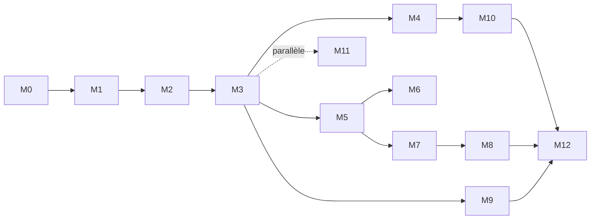

# 05 — Feuille de route

> **Statut** : v1.0 — en attente de validation
> Chaque module est une livraison **fonctionnelle et démontrable**. Après chaque
> module : démonstration, validation de ta part, puis passage au suivant.

---

## 1. Principe de découpage

Un module n'est pas une couche technique (« faire le back », « faire le
front ») mais une **tranche verticale** : base de données → logique métier →
interface → tests. À la fin de M2, on peut réellement suivre une leçon et
passer un quiz — pas « le modèle de données est prêt ».

Deux règles de séquencement :

- **Le moteur avant le contenu.** On construit le lecteur de leçon avec 4
  leçons réelles, pas 90. Écrire 90 leçons sur un moteur non validé serait la
  pire erreur possible du projet.
- **La valeur perceptible tôt.** M4 (atelier) et M5 (IA) sont les deux
  fonctionnalités qui différencient le produit ; elles arrivent avant la
  gamification et avant le volume de contenu.

---

## 2. Vue d'ensemble

```mermaid
gantt
    dateFormat X
    axisFormat %s
    title Séquencement (unité = 1 module ; les durées sont indicatives)

    section Socle
    M0 Fondations           :m0, 0, 1
    M1 Auth & profil        :m1, after m0, 1
    section Apprentissage
    M2 Moteur de leçons     :m2, after m1, 2
    M3 Quiz & SRS           :m3, after m2, 2
    section Différenciation
    M4 Atelier 2D           :m4, after m3, 3
    M5 Couche IA & chat     :m5, after m3, 2
    M6 Analyse photo        :m6, after m5, 1
    section Contenu & valeur
    M7 Bibliothèque         :m7, after m5, 2
    M8 Générateurs          :m8, after m7, 1
    M9 Progression          :m9, after m3, 1
    M10 Projet personnel    :m10, after m4, 2
    M11 Contenu 15 niveaux  :m11, after m3, 4
    M12 Finitions & prod    :m12, after m10, 2
```

M5 (IA) et M4 (atelier) sont indépendants après M3 : si tu veux voir l'IA plus
tôt, on peut les intervertir. M11 (rédaction du contenu) s'exécute en parallèle
de tout le reste dès que le moteur est validé.

---

## 3. Modules

### M0 — Fondations techniques

**Objectif** : un socle sur lequel tout le reste s'appuie sans friction.

- Monorepo pnpm + Turborepo, TypeScript `strict`, ESLint 9 flat + Prettier
- Next.js 15 App Router, Tailwind v4, tokens de couleur, bascule clair/sombre
- shadcn/ui installé, 10 primitives, page de galerie de composants
- `docker compose` : PostgreSQL + MinIO ; Prisma initialisé
- Vitest + Playwright + axe configurés ; pipeline GitHub Actions complète
- Validation Zod des variables d'environnement au démarrage

**Critères d'acceptation**
- `pnpm dev` fonctionne à partir d'un clone vierge en moins de 5 minutes
- La CI passe sur une PR vide (lint, types, tests, build, E2E « la page charge »)
- La bascule de thème fonctionne sans clignotement au rechargement
- Lighthouse ≥ 95 sur la page d'accueil

---

### M1 — Authentification, profil, onboarding

- Auth.js v5 : inscription/connexion e-mail + mot de passe (Argon2id), OAuth Google
- Réinitialisation de mot de passe par e-mail
- Onboarding 3 écrans + diagnostic express (5 questions) → `startingLevel`
- Page profil : thème, objectif hebdo, mouvement réduit, son
- Export RGPD (JSON) et suppression de compte
- Coquille applicative : barre latérale desktop, barre inférieure mobile

**Critères d'acceptation**
- E2E : inscription → onboarding → tableau de bord vide, en un test
- Tentative d'accès à une route protégée sans session → redirection
- L'export contient toutes les tables liées à l'utilisateur
- Audit axe : zéro violation sur les formulaires d'authentification

---

### M2 — Moteur de leçons

**Le module le plus structurant du projet.** Il fixe le format de tout le contenu.

- Chargement MDX + frontmatter validé par Zod, cache de compilation
- 11 types de blocs : texte, image annotée, schéma interactif, avant/après,
  erreur fréquente, conseil de pro, intérieur célèbre, à-retenir, tableau
  comparatif, emplacement vidéo, approfondissement repliable
- Lecteur de leçon : progression par blocs, reprise exacte (`blockIndex`)
- Carte de parcours 15 niveaux avec états et règles de déverrouillage
- Script de synchronisation contenu → base, idempotent, bloquant en CI
- **4 leçons réelles complètes** du niveau 1 (référence de qualité)

**Critères d'acceptation**
- Ajouter une leçon = créer un `.mdx` et lancer le seed. Rien d'autre.
- Un frontmatter invalide fait échouer le build avec un message exploitable
- Quitter une leçon au bloc 3 et revenir rouvre au bloc 3
- Page leçon : < 100 ko de JS, LCP < 1,5 s en 4G simulée
- Lecture au clavier de bout en bout, y compris les blocs repliables

---

### M3 — Quiz, exercices, répétition espacée

- 5 types de quiz + correction immédiate avec explication du *pourquoi*
- Exercices interactifs : palette, choix de matériau, points cliquables
- Évaluation de fin de niveau avec seuil et déverrouillage
- FSRS-6 dans `packages/domain/srs`, testé unitairement (≥ 95 %)
- Interface de révision : carte retournable, 4 notations, file quotidienne
- Génération automatique des cartes depuis le frontmatter des leçons

**Critères d'acceptation**
- Les tests FSRS reproduisent les intervalles de référence de l'algorithme
- Une session de révision de 20 cartes se fait entièrement au clavier
- Échouer une évaluation ne verrouille rien et propose une remédiation ciblée
- La file de révision se charge en < 200 ms avec 5 000 cartes en base

---

### M4 — Atelier 2D

- Canevas react-konva : panoramique, zoom, grille, magnétisme, règles
- Créer une pièce (rectangulaire puis polygonale), cotation numérique éditable
- Murs (épaisseur, hauteur), portes et fenêtres posées sur un mur, débattement
- Catalogue de mobilier avec empreinte au sol ; placement, rotation, alignement
- Application couleurs/matériaux sur sols, murs, plafond, mobilier
- **Analyse de circulation temps réel** : passages, dégagements, collisions
- Versions : enregistrer, dupliquer, renommer, restaurer
- Comparateur avant/après en volet glissant
- Accessibilité canevas : arbre DOM parallèle + manipulation clavier complète

**Critères d'acceptation**
- 60 fps avec 150 objets sur un portable milieu de gamme
- La géométrie est testée unitairement sans navigateur (`packages/domain/geometry`)
- Une pièce complète se construit **entièrement au clavier**
- Recharger la page restaure la scène à l'identique (aucune perte)
- Une porte ne peut pas être placée hors d'un mur (invariant testé)

---

### M5 — Couche IA et assistant

- Port `AiProvider` + adaptateur Anthropic + adaptateur factice
- Catalogue de prompts versionnés, prompt système mis en cache
- Chat en streaming (SSE) avec contexte de leçon/projet
- Correction d'exercices ouverts selon barème, sortie structurée Zod
- RAG sur la bibliothèque (pgvector + plein texte), citations obligatoires
- Garde-fous : pré-filtrage des sujets à risque, post-validation de schéma
- `AiUsage` : quotas, coûts, tableau d'administration

**Critères d'acceptation**
- Tests de contrat passant à l'identique sur l'adaptateur réel et le factice
- Premier token affiché en < 2 s (p95, mesuré)
- Une question sur un mur porteur déclenche le renvoi vers un professionnel
  **sans consommer d'appel IA**
- Quota atteint → message clair, aucune erreur technique visible
- Fournisseur indisponible → l'application reste pleinement utilisable

---

### M6 — Analyse photo

- Téléversement (URL présignée), suppression EXIF, redimensionnement ≤ 1568 px
- Analyse structurée : style, proportions, circulation, lumière, problèmes gradués
- Repères numérotés positionnés sur l'image
- Améliorations classées par effort et budget, chacune justifiée
- Cache par SHA-256 ; historique des analyses par pièce
- Passerelle « ouvrir dans l'atelier »

**Critères d'acceptation**
- Une photo de 12 Mo est traitée sans erreur ni dépassement de délai
- Les coordonnées GPS sont effacées avant tout stockage (test dédié)
- Réanalyser la même image ne déclenche aucun appel IA
- Chaque problème remonté comporte un *pourquoi* non générique
- Une photo non pertinente (paysage) est détectée et signalée poliment

---

### M7 — Bibliothèque

- Fiches en MDX, 18 catégories, schémas d'attributs par catégorie
- Recherche plein texte française + filtres à facettes
- Graphe de relations (s'associe / à éviter / alternative)
- Favoris et collections
- **≥ 300 fiches** : 25 styles, 60 matériaux, 40 couleurs, 175 objets/éléments
- Indexation vectorielle pour le RAG

**Critères d'acceptation**
- La recherche répond en < 150 ms sur 300 fiches
- Chaque fiche a description, avantages, inconvénients, budget, entretien,
  associations et erreurs — vérifié par un test de complétude sur le corpus
- Les relations sont bidirectionnellement cohérentes (test d'intégrité)

---

### M8 — Générateurs

- Palettes de couleurs (avec vérification de contraste et justification)
- Moodboards : génération + édition libre glisser-déposer + export image
- Listes de mobilier dimensionnées à partir de la pièce réelle
- Matériaux compatibles, plan d'éclairage, accessoires, végétaux (exposition)

**Critères d'acceptation**
- Tout élément généré est relié à une fiche bibliothèque quand elle existe
- Une palette générée respecte les contrastes annoncés (test automatisé)
- Un moodboard s'exporte en PNG fidèle au rendu écran

---

### M9 — Progression et gamification

- Moteur XP, badges déclaratifs, séries avec gel
- Objectif hebdomadaire, mesure de temps par heartbeat
- Tableau de bord complet : prochaine action, révisions, points faibles
- Recommandations personnalisées

**Critères d'acceptation**
- Les règles XP et badges sont pures et testées, sans accès base
- La série résiste aux changements de fuseau horaire (test dédié)
- Le temps mesuré exclut les périodes d'inactivité (test avec onglet caché)

---

### M10 — Projet personnel

- Création de projet lié au logement réel, pièces, états d'avancement
- Import de plan (image/PDF), calibrage d'échelle, tracé par-dessus
- Photos par pièce, notes, journal de projet
- Versions et comparaison de propositions
- Mode « architecte accompagnateur » : mémoire longitudinale du projet
- Export dossier PDF

**Critères d'acceptation**
- Un plan calibré donne des mesures justes à ±2 % (test avec plan de référence)
- L'IA se souvient des contraintes énoncées lors des sessions précédentes
- L'export PDF contient plans, moodboards, listes et budget

---

### M11 — Contenu des 15 niveaux

Exécuté **en parallèle** dès M3 validé.

- ~90 leçons, ~350 exercices, ~450 cartes mémoire
- 4 projets jalons (fin de chaque phase)
- 12 fiches d'intérieurs célèbres
- Défis hebdomadaires

**Critères d'acceptation**
- Chaque leçon respecte le gabarit et passe la validation de frontmatter
- Chaque niveau a une évaluation finale calibrée
- Relecture croisée : cohérence du vocabulaire d'un niveau à l'autre
- Aucune illustration sous droits ; texte alternatif rédigé partout

---

### M12 — Finitions et mise en production

- Passe accessibilité complète (audit clavier + lecteur d'écran)
- Optimisation performance, budgets bloquants
- Sentry, OpenTelemetry, tableaux de bord de supervision
- Sauvegardes + restauration testée
- Politique de confidentialité, CGU, déclaration d'accessibilité
- Documentation d'exploitation

**Critères d'acceptation**
- Tous les budgets de performance tenus sur les 10 pages clés
- Zéro violation axe critique/sérieuse
- Une restauration de sauvegarde est effectuée avec succès en conditions réelles
- Un parcours complet inscription → premier projet est validé de bout en bout

---

## 4. Dépendances critiques

**Chemin critique** : M0 → M1 → M2 → M3 → M4 → M10 → M12.
Tout retard sur **M2** décale l'intégralité du projet, y compris la rédaction du
contenu. C'est le module sur lequel il faut être le plus exigeant à la
validation.

---

## 5. Protocole de validation par module

À la fin de chaque module, je te livre :

1. **Une démonstration** — le parcours à tester toi-même, pas à pas.
2. **Ce qui est fait / ce qui ne l'est pas** — explicitement, sans arrondi.
3. **Les décisions prises en cours de route** et leur justification.
4. **Les tests** — ce qui est couvert, ce qui ne l'est pas et pourquoi.
5. **Ce que je propose pour la suite**, avec les arbitrages ouverts.

Tu valides, tu demandes des ajustements, ou tu réorientes. Je n'enchaîne pas
sur le module suivant sans ton accord explicite.

---

## 6. Ce que je recommande de faire en premier

Si tu valides cette Phase 0, je propose d'enchaîner sur **M0 + M1 en une seule
livraison** : séparément, M0 n'a rien de visible à démontrer, alors que
M0 + M1 te donne une application où tu peux réellement créer ton compte et
voir la coquille de l'interface. C'est un meilleur point de validation.

Les cinq questions ouvertes du
[cahier des charges §10](01-cahier-des-charges.md#10-questions-ouvertes-à-trancher-avant-m1)
doivent être tranchées avant M1 — mes recommandations y sont indiquées, il
suffit de confirmer ou corriger.
